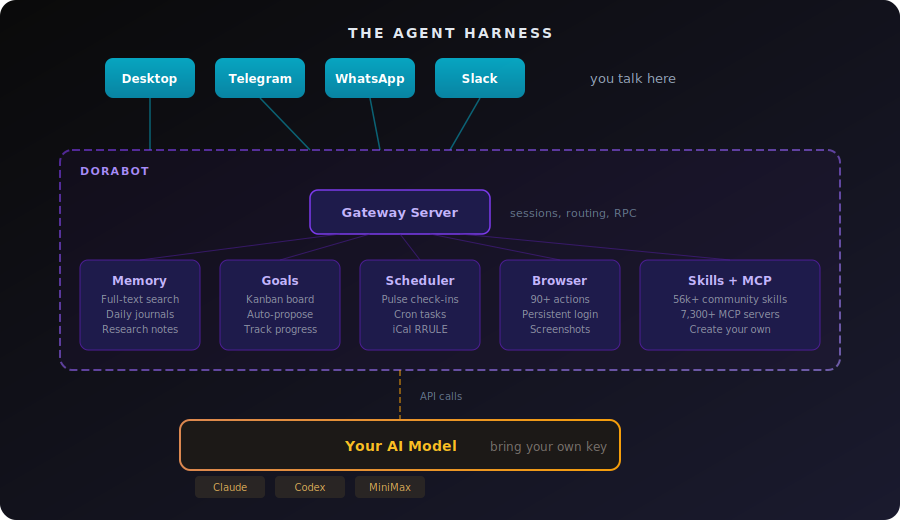

<div align="center">
  

  # dorabot

  **Turn Claude Code into your personal AI agent.**

  [](https://github.com/suitedaces/dorabot/releases/latest)
  [](LICENSE)
  [](https://github.com/suitedaces/dorabot/releases/latest)

  You're already paying for Claude Pro/Max or an API key. dorabot wraps that same model in an agent harness that gives it memory, messaging, goals, a scheduler, browser control, and a desktop app. It runs locally on your Mac, keeps everything on-device, and works while you sleep.

  [Download for macOS](https://github.com/suitedaces/dorabot/releases/latest) · [Website](https://dora.so)

</div>


## How It Works

dorabot is an **agent harness**. It doesn't train a model or host an API. It takes the model you already have (Claude, Codex, or MiniMax) and wraps it in the infrastructure a real agent needs:



The model does the thinking. dorabot gives it hands, eyes, a calendar, and a way to reach you.

## What Makes It Different

**It's autonomous.** Set pulse intervals (every 30 minutes, hour etc) and the agent wakes up on its own, checks what needs doing, proposes new goals, picks up approved tasks, and messages you when it's done. You approve with a click, it ships the work.

**It reaches you anywhere.** WhatsApp, Telegram, Slack, or the desktop app. Same agent, same memory, every channel. It doesn't sit in a terminal waiting for you to come back.

**It remembers everything.** Full-text search across every past conversation. Daily journals. Research notes. Context that builds over time and carries across sessions.

**It's local and private.** Runs on your Mac. No cloud relay. Your conversations, memory, and browser sessions stay on-device. 

## Quick Start

### Download (recommended)

[Download the macOS app](https://github.com/suitedaces/dorabot/releases/latest). Open the DMG, drag to Applications, done. The onboarding flow walks you through connecting your model, setting up channels, and personalizing the agent.

**Requirements:** macOS, a Claude API key or Pro/Max subscription (or OpenAI/MiniMax API key). Chrome/Brave/Edge optional for browser features.

### Build from source

```bash
git clone https://github.com/suitedaces/dorabot.git
cd dorabot
npm install
npm run build
npm link
```

```bash
npm run dev           # gateway + desktop with HMR
npm run dev:gateway   # gateway only with watch mode
npm run dev:cli       # interactive CLI mode

dorabot -g            # production gateway mode
dorabot -i            # interactive terminal
dorabot -m "message"  # one-off question
```

## The Desktop App


> The Kanban board where the agent proposes goals autonomously and you drag them through Proposed → Approved → In Progress → Done.

- **Chat** with streaming responses and inline tool use
- **Goals** on a drag-and-drop Kanban board. The agent proposes, you approve, it executes.
- **Automations** for pulse intervals, scheduled tasks, and recurring check-ins
- **Channels** to connect WhatsApp (QR scan), Telegram (bot token), Slack (app tokens)
- **Soul** editor for personality (SOUL.md), profile (USER.md), and memory (MEMORY.md)

## Channels

| Channel | Setup |
|---------|-------|
| **WhatsApp** | `dorabot --whatsapp-login` to scan QR, or connect from the desktop app |
| **Telegram** | Create a bot with [@BotFather](https://t.me/BotFather), paste the token |
| **Slack** | Create a Socket Mode app, add bot + app-level tokens |
| **Desktop** | Just open the app |

All channels share the same agent and memory. Text, photos, videos, audio, documents, voice messages, and inline approval buttons on Telegram.


> Telegram: the agent reports progress, pushes branches, and follows up, all without leaving the chat.

## Providers

Use the model you're already paying for.

| Provider | Auth |
|----------|------|
| **Claude** (default) | API key or Pro/Max subscription via [Claude Agent SDK](https://www.npmjs.com/package/@anthropic-ai/claude-agent-sdk) |
| **OpenAI Codex** | API key or ChatGPT Plus/Pro OAuth |
| **MiniMax** | API key (OpenAI-compatible endpoint) |

Switch from the desktop Settings page or via gateway RPC.

## Skills

9 built-in (GitHub, email, macOS control, image gen, memes, onboarding, Polymarket, Remotion, agent swarms) plus three ways to add more:

- **Gallery**: Browse and one-click install from 56k+ community skills on [skills.sh](https://skills.sh)
- **Manual**: Drop a `SKILL.md` in `~/.dorabot/skills/your-skill/`
- **Agent-created**: Ask "make me a skill for deploying to Vercel" and the agent writes it on the spot

## Connectors (MCP)

Add external tools via the [Model Context Protocol](https://modelcontextprotocol.io/). Browse the [Smithery](https://smithery.ai) registry in the desktop app, or configure manually:

```json
{
  "mcpServers": {
    "postgres": {
      "command": "npx",
      "args": ["-y", "@modelcontextprotocol/server-postgres", "postgresql://..."]
    }
  }
}
```

## Personalization

The first time you open the app, the onboarding flow helps you set up your model, channels, and profile. After that, the `onboard` skill does a deeper interview to build your:

| File | Purpose |
|------|---------|
| `SOUL.md` | How the agent talks and thinks |
| `USER.md` | Who you are, your goals, preferences |
| `MEMORY.md` | Facts that persist across every session |

All workspace files live in `~/.dorabot/workspace/`. Edit them directly or let the agent manage them.

## Security

- Runs locally. No cloud relay, no remote servers.
- Scoped file access (default: `~/`, `/tmp`). Sensitive dirs always blocked (`~/.ssh`, `~/.gnupg`, `~/.aws`).
- Token-authenticated gateway (256-bit hex).
- Configurable tool approval tiers: auto-allow, notify, or require-approval.
- Channel-level security policies.
- macOS app sandbox for native permission management.

## License

MIT
